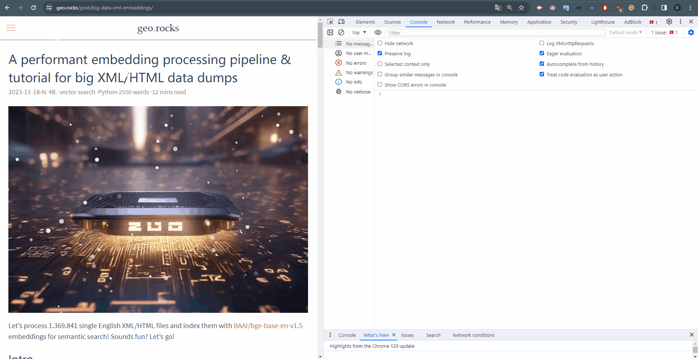

# Vatican Windrose
The four Vatican wind rose marble markers of St. Peter's Square from Filippo Luigi Gilij (1817) turned into controls for your webpage or Leaflet map. 

## Version 1: Webpage Controls
Copy and paste the script in [add_to_webpage.js](https://github.com/do-me/vatican-windrose/blob/main/add_to_webpage.js) in your browser console. It adds the markers to your webpage as page controls. A click scrolls in the respective direction. 

## Version 2: Leaflet Map Controls
Copy and paste the script in [add_to_leaflet.js](https://github.com/do-me/vatican-windrose/blob/main/add_to_leaflet.js) in your browser console. It adds the markers to your webpage as Leaflet Map controls. A click scrolls in the respective direction. Note that the `map` variable must be global. Test e.g. here: https://geo.rocks/hexbins/.

## To Do: 
- npm package
- simple css wind animation, blowing from the markers towards the center
- clicking effect

## Info
- Images: Dominik Weckmüller 30/04/2023
- Historical Info: https://www.epogea.eu/en/works/wind-rose-st-peter/
- Location: St. Peter's Square, Vatican https://www.openstreetmap.org/#map=17/41.90217/12.4570
- Fun Fact: a copy of the Eastern one made it to [China: Beijing Horticulture Expo](https://www.epogea.eu/en/works/wind-rose-st-peter/)

## Why? 
For fun mainly. On a second thought the controls might actually be useful for accessibility.
